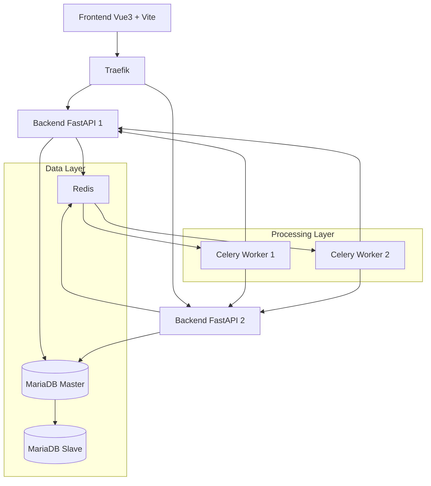
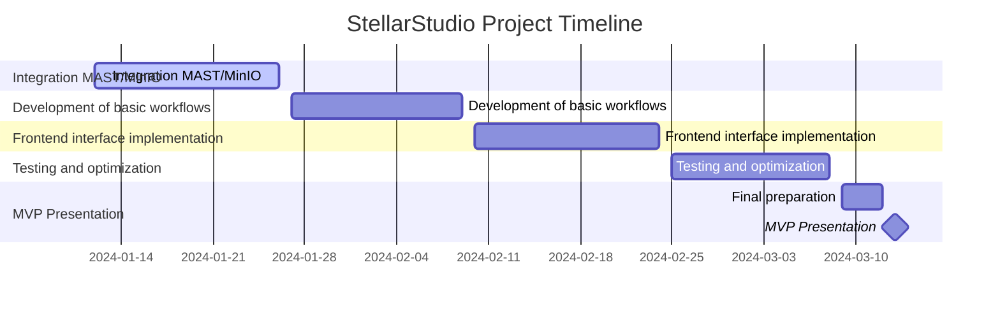

# Portfolio Project - Team Formation and Idea Development (Stage 1)

## Table of Contents

1. [Team Formation Overview](#team-formation-overview)
    - [Team Composition](#team-composition)
    - [External Stakeholders](#external-stakeholders)
    - [Collaboration Strategy](#collaboration-strategy)

2. [Ideas Explored](#ideas-explored)
    - [List of Considered Ideas](#list-of-considered-ideas)
    - [Reasons for Rejections](#reasons-for-rejections)
    - [Selected Solution](#selected-solution)

3. [Selected MVP Concept](#selected-mvp-concept)
    - [Inspiration (AstroBin & PixInsight)](#inspiration-astrobin--pixinsight)
    - [Smart Objectives](#smart-objectives)
    - [Target Audience](#target-audience)
    - [Features by Expertise Level](#features-by-expertise-level)
    - [Technical Innovation](#technical-innovation)
    - [Project Scope](#project-scope)

4. [Project Analysis](#project-analysis)
    - [Reasons for Selection](#reasons-for-selection)
    - [Potential Challenges](#potential-challenges)
    - [Opportunities](#opportunities)

5. [Conclusion](#conclusion)
    - [Technical Challenge](#technical-challenge)
    - [Community Impact](#community-impact)
    - [Personal Development](#personal-development)
    - [Future Evolutions](#future-evolutions)

## Team Formation Overview

### Team Composition

Our team is composed of three passionate developers, each bringing complementary skills:

- **Fassih**: Lead Developer & Project Manager
  - Expertise in software architecture and DevOps
  - Experience in agile project management
  - Passionate about automation and best practices

- **Fassih2**: Full-Stack Developer & UX Designer
  - Expertise in frontend and backend development
  - Skills in user interface design
  - Passionate about astronomy and photography

- **Fassih3**: Technical Lead & Quality Assurance
  - Expertise in Python and automated testing
  - Skills in code review and documentation
  - Passionate about best development practices

### External Stakeholders

- **Holberton School**
  - Project evaluators (hoping they appreciate our sense of humor)
  - Technical mentors (when we're really stuck)
  - My very dears and beloved fellow holbie students (for moral support and debugging sessions)

- **Astronomical Community**
  - MAST Portal (our celestial data provider)
  - Astrometry.net (helping us not get lost in space)
  - Amateur astronomers (our future power users)
  - Aunt Claude and Grandma Jeanine (our most enthusiastic beta testers)

### Collaboration Strategy

- Communication via telepathy for daily exchanges
- GitHub for versioning and code review
- Daily IRL meetings for watch synchronization (Parker Lewis Ne Perd Jamais #i_feel_old)
- Regular updates to external stakeholders (when Mercury is not retrograde)

## Ideas Explored

### List of Considered Ideas

1. Astronomical Image Collection Manager
2. Observatory Webcam Streaming Platform
3. Amateur Exoplanet Detection System
4. Augmented Reality Sky Observation App
5. Sky Panoramic Image Stitching Tool
6. Crowdsourcing Platform for Galaxy Classification
7. StellarStudio: Astronomical Image Processing

### Reasons for Rejections

1. **Astronomical Image Collection Manager**
    - *Rejected*: Lack of advanced processing features

2. **Observatory Webcam Streaming Platform**
    - *Rejected*: Excessive dependency on external infrastructures

3. **Amateur Exoplanet Detection System**
    - *Rejected*: Too specialized for a broad audience

4. **Augmented Reality Sky Observation App**
    - *Rejected*: Technical complexity too high for an MVP

5. **Sky Panoramic Image Stitching Tool**
    - *Rejected*: Interesting feature but too limited as a main project

6. **Crowdsourcing Platform for Galaxy Classification**
    - *Rejected*: Requires a large user base from the start

### Selected Solution

7. **StellarStudio: Astronomical Image Processing**
    - *Selected*: Perfect alignment with our skills and passions

## Selected MVP Concept

### Inspiration (AstroBin & PixInsight)

StellarStudio aims to combine the strengths of two major astrophotography tools:

- **AstroBin**: A community platform launched in 2011, allowing astrophotographers to share their images, get expert feedback, and access a database of equipment.

- **PixInsight**: An advanced astronomical image processing software, offering powerful tools like calibration, automatic alignment, and multi-scale processing. It is known for its scientific rigor and precision.

This approach combines the social aspects of AstroBin with the processing power of PixInsight, all accessible from any web browser: ACCESSIBLE AT AUNT CLAUDE'S OR GRANDMA JEANINE'S ("Grand-maman NINE-JA", for close friends (in verlan :D).)

### SMART Objectives

**By March 13, 2024 (MVP Presentation):**

1. **Image Processing Pipeline**
   - Implement a functional MAST/MinIO pipeline capable of downloading and processing HST FITS files
   - Success metric: Process at least 3 different types of astronomical objects (nebulae, galaxies, star clusters)
   - Target performance: Complete processing within 5 minutes per image

2. **User Interface Development**
   - Create an intuitive web interface for beginners to process astronomical images
   - Success metric: Enable users to complete basic image processing in less than 10 clicks
   - Include at least 3 pre-configured processing workflows

3. **Technical Infrastructure**
   - Deploy a scalable architecture handling multiple simultaneous processing requests
   - Success metric: Successfully process 5 concurrent image requests
   - Maintain system stability with 95% uptime during processing operations

4. **Documentation and Testing**
   - Achieve 80% test coverage for critical processing functions
   - Provide comprehensive API documentation via FastAPI's automatic documentation
   - Include beginner-friendly tutorials for each pre-configured workflow

### Target Audience

StellarStudio caters to three main user groups:
1. Beginners
2. Intermediates
3. Advanced Users

### Features by Expertise Level

**For Beginners:**
- Access to images from major telescopes via the MAST/Astroquery portal
- Automated processing with AI (VertexAI) for:
  - Basic calibration
  - Noise reduction
  - Detail enhancement

**For Intermediates:**
**Begginers Features + :**
- Advanced processing tools:
  - Dynamic Background Extraction
  - Stacking
  - Gradient correction
- Import and processing of their own images
- Contribution to citizen science projects

**For Advanced Users:**
**Intermediates Features + :**
- Customizable workflows
- Professional processing tools
- Ability to monetize their workflows
- Participation in astronomical research

### Technical Innovation

**Distributed processing via containers**
- Multi-container Docker architecture:
  - FastAPI backend for the REST API
  - Celery workers for asynchronous image processing
  - Redis for cache and message broker
  - MariaDB for persistent storage
- Load balancing with Traefik for scalability

**AI for automation (VertexAI/Azure)**
- Automatic detection of celestial object type (galaxy, nebula, etc.)
- Processing parameter suggestions based on object type
- Intelligent noise reduction adapted to image type
- Automatic image classification for organization

**Integration with astrometry.net**
- Precise identification of celestial objects
- Astrometric calibration of images
- Automatic enrichment of FITS metadata

**Community rating and validation system**
- Voting system on processed images
- Sharing and evaluation of processing workflows
- Recognition badges for demonstrated expertise

### Project Scope

**In Scope (MVP for March 13, 2024)**
- Image Sources and Formats
  - MAST Integration (HST/JWST FITS files)
  - Support for DSLR RAW formats (Canon, Nikon, Sony)
  - Basic mosaic assembly for multi-panel images
  - HDR processing for high dynamic range objects

- Image Processing
  - Basic calibration and stacking
  - Automated workflows for beginners
  - Manual parameter adjustment for advanced users
  - Integration with astrometry.net for plate solving

- User Interface
  - Web-based processing interface
  - Basic user authentication
  - Progress tracking for processing tasks
  - Result visualization and download

**Out of Scope**
- Real-time telescope control and image acquisition
- Advanced social features (messaging, forums)
- Mobile application development
- Direct integration with commercial telescopes
- Offline processing capabilities
- Advanced user management (roles, permissions)
- Subscription system implementation

**Future Considerations** *(Post-MVP)*
- Integration with additional data sources (ESO, ALMA)
- Advanced workflow sharing system
- Community features and social interactions
- Mobile-responsive interface
- Premium feature implementation

### timeline

## Project Analysis

### Reasons for Selection

1. **Technical Feasibility**
    - Mastered and modern technology stack:
      * Backend: Python 3.10+, FastAPI for optimal performance
      * Frontend: Vue.js 3 with Composition API
      * Database: MariaDB for reliability + MiniO for FITS files stocking
      * Cache and message broker: Redis
    - Specialized libraries:
      * Scikit-learn for ML and image processing
      * Three.js for 3D visualization of celestial objects
      * D3.js for interactive charts and data visualization
    - Robust astronomical APIs:
      * MAST/Astroquery for telescope data access
      * Astrometry.net for plate-solving
      * Astropy for FITS file processing
    - Scalable architecture:
      * Docker Compose for containerization
      * Traefik for simple load balancing
      * Celery for asynchronous processing
      * Prometheus and Grafana for Server side Monitoring

2. **Innovation**
    - Democratization of astronomical image processing:
      * Intuitive user interface for beginners
      * Advanced tools for experienced users
      * Interactive 3D visualization of celestial objects
      * No local installation required
    - Unique collaborative approach:
      * Sharing of processing workflows
      * Community rating system
      * Collective learning
      * Shared visualization of astronomical data
    - Accessible AI integration:
      * Automatic detection of celestial objects with scikit-learn
      * Processing parameter suggestions
      * Automatic image classification
      * Interactive visualization of results

3. **Alignment with Objectives**
    - Modern and relevant technologies:
      * Lightweight microservices architecture
      * REST API with automatic documentation
      * CI/CD with GitHub Actions
      * Modern visualization stack (Three.js, D3.js)
    - Stimulating technical challenges:
      * Scientific image processing with scikit-learn
      * 3D visualization of astronomical objects
      * Handling large data volumes
      * Performance and scalability
    - Contribution to citizen science:
      * Processing of space telescope images
      * Potential participation in discoveries
      * Creation of a collaborative database
      * Interactive visualization of discoveries

### Potential Challenges

1. **Technical**
    - Asynchronous processing of large images:
      * Efficient handling of FITS files (often > 100MB)
      * Task distribution via Celery
      * Memory optimization during processing
    - Cache and storage management:
      * Strategy for cleaning temporary files
      * Optimization of Redis cache for metadata
      * User storage limits management
    - Image processing performance:
      * Optimization of scikit-learn algorithms
      * Task parallelization
      * Timeout management for long processes
    - Horizontal scalability and load balancing:
      * Deployment of multiple backend/Celery instances with Docker
      * Load balancer configuration and optimization (Traefik)
      * Autoscaling of instances based on load
      * Efficient distribution of Celery workers across multiple Docker containers
      * Resource optimization on NAS hardware

2. **Functional**
    - Complexity of processing algorithms:
      * Precise calibration of astronomical images
      * Noise reduction without detail loss
      * Parameter adaptation based on object type
    - Intuitive user interface:
      * Smooth 3D visualization with Three.js
      * Interactive charts with D3.js
      * Real-time processing feedback
    - Handling specific image formats:
      * Correct manipulation of FITS headers
      * Data conversion for web display
      * Preservation of astronomical metadata

3. **Organizational**
    - Resource management:
      * Balancing performance and costs
      * User usage limits
      * Scaling and resource monitoring planning
    - Documentation:
      * Tutorials for beginners
      * Technical API documentation
      * Image processing guides
    - Community:
      * Moderation of shared content
      * Validation of published workflows
      * User feedback management

### Opportunities

1. **Technical**
    - Learning new technologies:
      * Modern stack Python/FastAPI/Vue.js
      * Scientific image processing with scikit-learn
      * 3D visualization with Three.js and D3.js
      * Docker container management and load balancing
    - Scalable architecture:
      * Clear separation frontend/backend/workers
      * Well-documented RESTful API
      * Queue system with Celery/Redis
      * Possibility to add new services
    - CI/CD and quality:
      * Automated tests (unit, integration)
      * GitHub Actions for deployment
      * Performance monitoring
      * Automated technical documentation

2. **Business**
    - Growing amateur astronomy community:
      * Democratization of connected telescopes
      * Increasing interest in astrophotography
      * Need for accessible processing tools
    - Monetization potential:
      * Premium subscriptions with more resources
      * Access to advanced algorithms
      * Extended image storage
      * Custom workflows
    - Potential collaborations:
      * Partnerships with astronomy clubs
      * Integration with telescope manufacturers
      * Contribution to citizen science projects
      * Participation in astronomical discoveries

3. **Educational**
    - Training and sharing:
      * Image processing tutorials
      * Astronomical observation guides
      * Experience sharing among users
    - Citizen science:
      * Participation in research projects
      * Classification of celestial objects
      * Detection of new phenomena
    - Supportive community:
      * Discussion forums
      * Mentorship sessions
      * Virtual events

## Conclusion

StellarStudio represents an ambitious project that meets several objectives. While ambitious in scope, this MVP strikes a balance between innovation and feasibility, leveraging modern technologies to democratize astronomical image processing.

### Technical Challenge
- Use of modern technologies
- Scalable and evolving architecture
- Complex scientific image processing

### Community Impact
- Democratization of amateur astronomy
- Contribution to citizen science
- Creation of a supportive community

### Personal Development
- Skill development on key technologies
- Learning scientific image processing
- Management of a complex project

### Future Evolutions

This MVP, although technically demanding, remains achievable with the available resources. The project can evolve based on:
- User feedback
- Technological advances
- Collaboration opportunities
- Discovered technical constraints

The specifications and technical choices presented in this document are subject to change to adapt to the project's needs and real-world conditions.

