# StellarStudio System Architecture

## System Overview
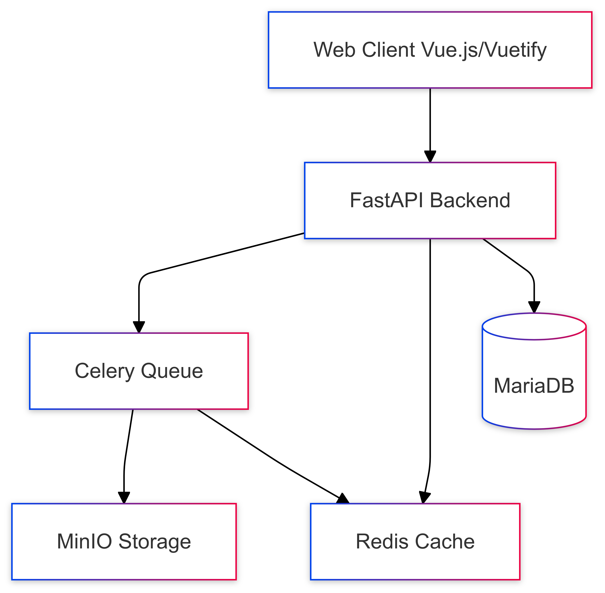

### Design Principles
- Modular architecture
- Secure by design
- Scalable infrastructure
- Performance-oriented processing

### System Requirements
- Reliable service availability
- Efficient image processing pipeline
- Secure data handling
- Scalable user management

## Component Interactions
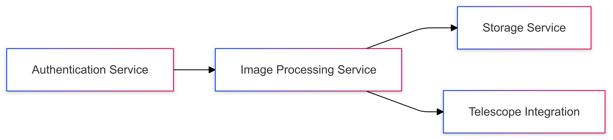

## System Architecture
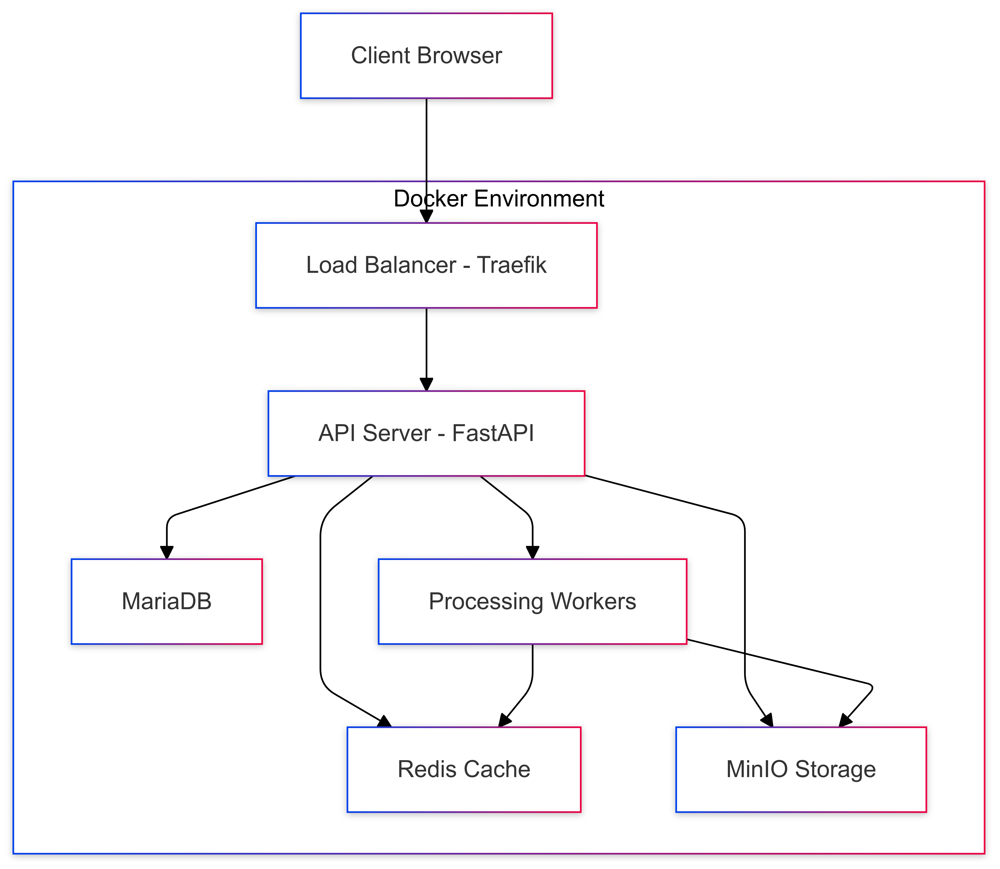

### Frontend Architecture
- Target selection interface
- Processing workflow management
- User administration dashboard
- Image gallery system

#### Interface Design

##### Splash Screen
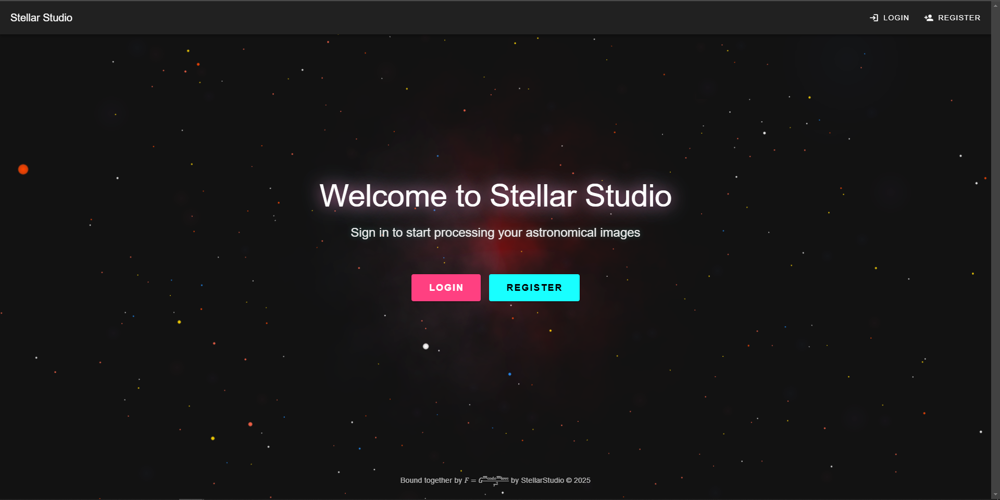

##### Login Interface
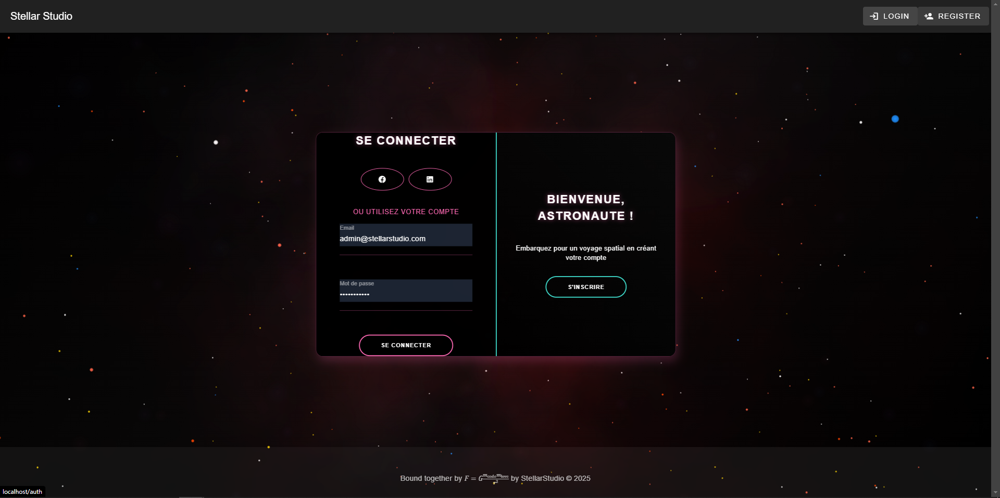

##### Home Dashboard
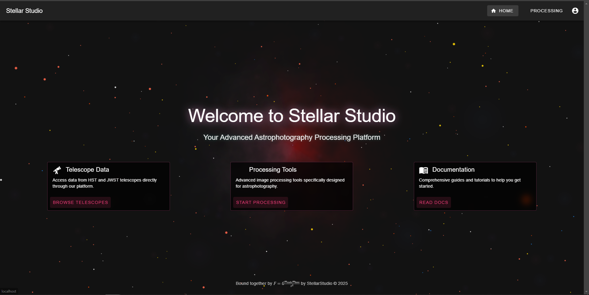

##### Processing Pipeline
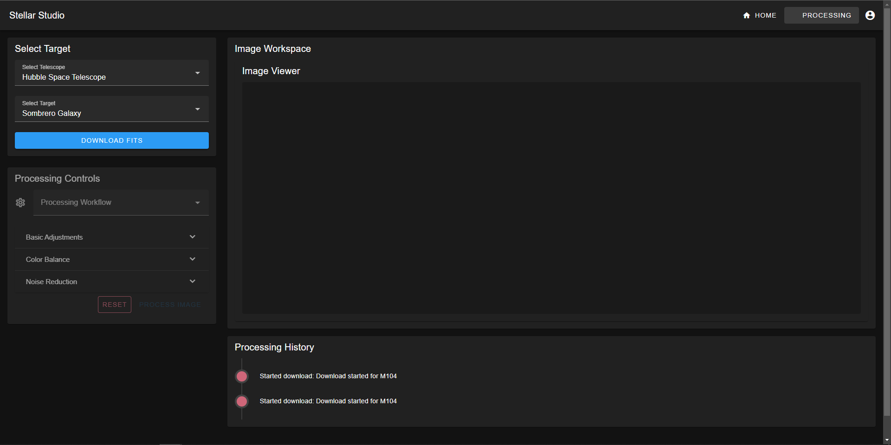

### Backend Services
- Authentication and authorization
- Image processing pipeline
- Astronomical catalog integration
- Data management system

## Data Architecture
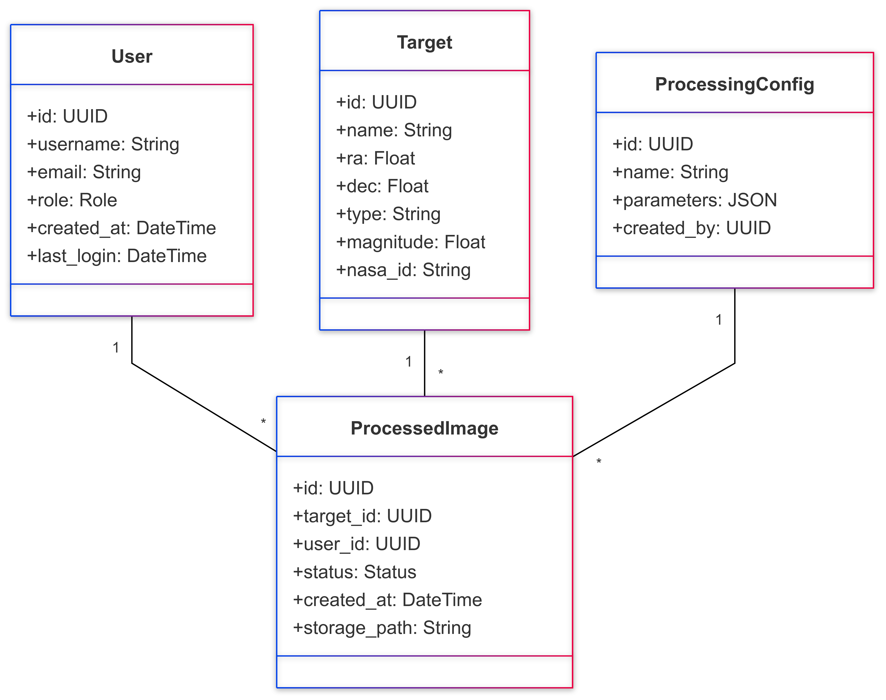

## Data Flow Overview
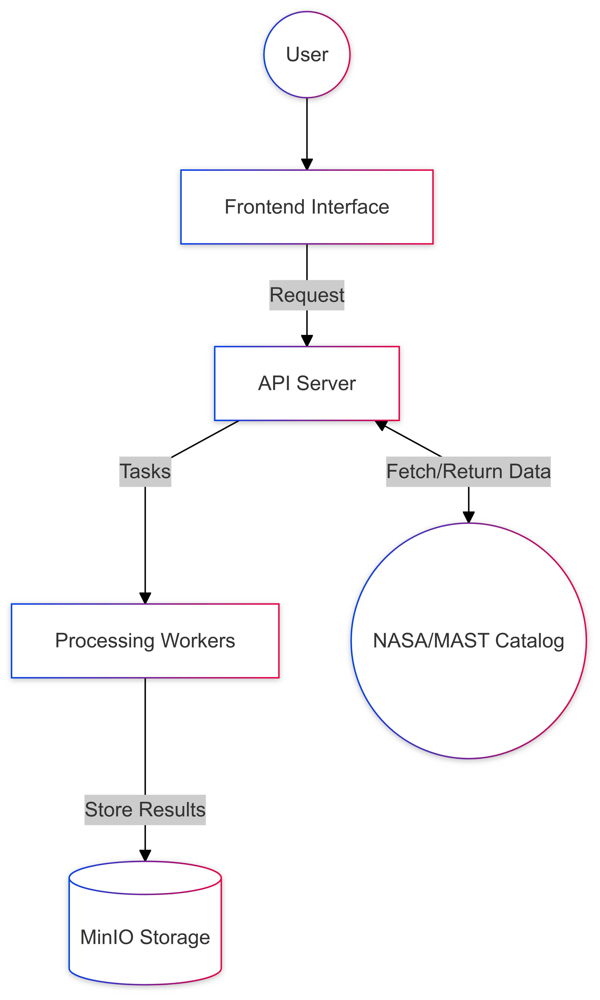

## Key Workflows

### Authentication Flow
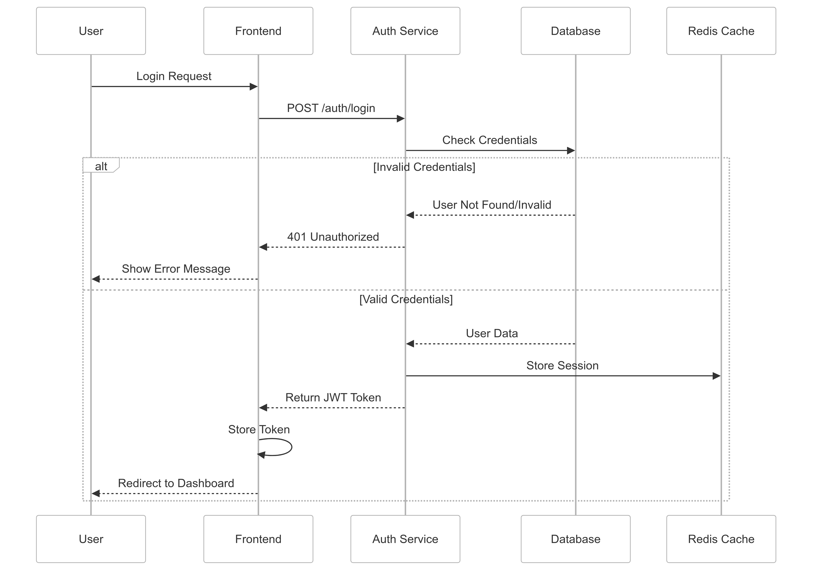

Key security features:
- Token-based authentication
- Session management
- Secure credential handling
- Role-based permissions

### Data Processing Flow
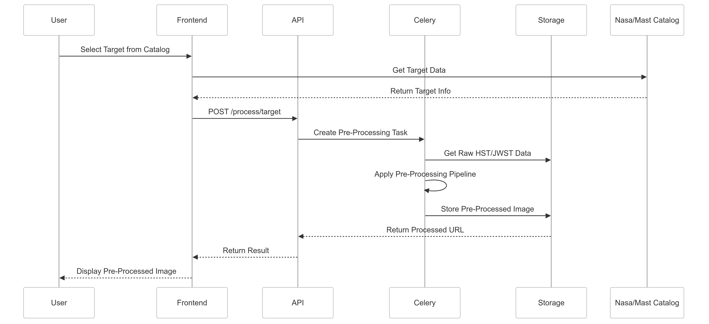
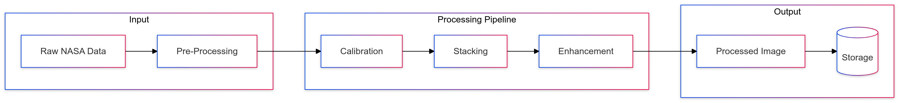

Core processing features:
- NASA/MAST data integration
- Automated pre-processing
- Scientific image handling
- Storage optimization

## Infrastructure Components

### Storage Layer
- Object storage system
- Relational database
- Metadata management
- Backup solutions

### Processing Layer
- Task processing system
- Resource management
- Scientific computations
- Results handling

### API Layer
- RESTful architecture
- Security implementations
- Performance optimization
- System documentation

## Deployment Strategy
### Development Environment
- Containerized development
- Local storage systems
- Database management
- API integrations

### Production Environment
- Container orchestration
- Load balancing
- System monitoring

### Future Considerations
- Enhanced scaling solutions
- Advanced testing implementation
- Security enhancements
- Development workflow optimization
